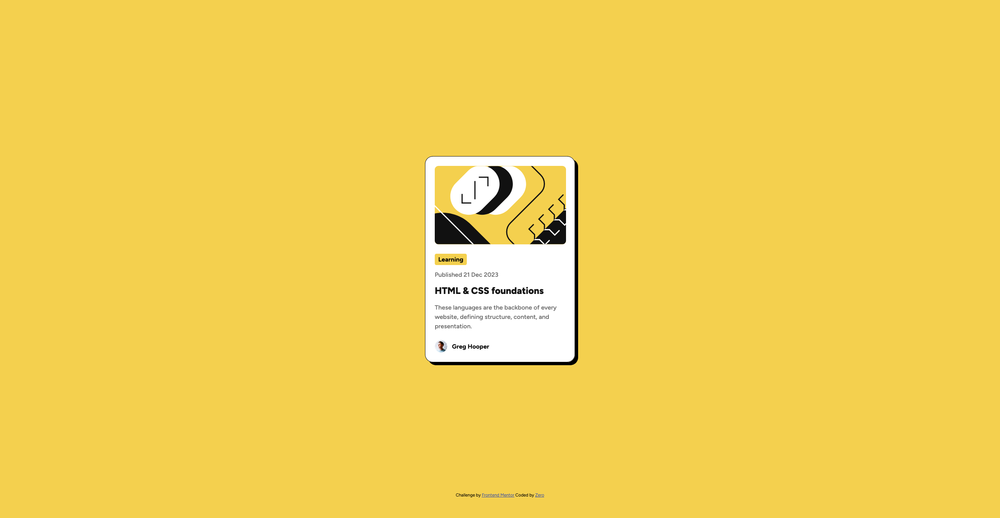

# Frontend Mentor - Blog preview card solution

This is a solution to the [Blog preview card challenge on Frontend Mentor](https://www.frontendmentor.io/challenges/blog-preview-card-ckPaj01IcS). Frontend Mentor challenges help you improve your coding skills by building realistic projects. 

## Table of contents

  - [Overview](#overview)
    - [The challenge](#the-challenge)
    - [Screenshot](#screenshot)
    - [Links](#links)
  - [My process](#my-process)
    - [Built with](#built-with)
    - [What I learned](#what-i-learned)
    - [Continued development](#continued-development)
    - [Useful resources](#useful-resources)

## Overview

  ### The challenge

    Users should be able to:

    - See hover and focus states for all interactive elements on the page

  ### Screenshot

  

  ### Links

  - Solution URL: (https://digitaljsn.github.io/blog-preview-card/)

## My process

  ### Built with

    - Semantic HTML5 markup
    - CSS custom properties
    - Flexbox
    - Mobile-first workflo

  ### What I learned

    I learned and implemented the :focus pseudo class and continued to reinforce my retention of the :hover pseudo class. Also learned about adding 'tabindexes' to the html.

    Code snippets, see below:

    ```html
    
    ```
    ```css
    .avatar-img:hover {
        cursor: pointer;
    }
    .avatar-img:focus {
        box-shadow: 0 0 0 3px var(--Yellow);
        transform: scale(2);
    }
    ```
  
  ### Continued development

    Looking forward to new projects that expand my knowledge of design and how to implement new elements and classes to make those designs a reality.

  ### Useful resources

     - Google Gemini was helpful in explaining the :focus pseudo class and how it worked. 

